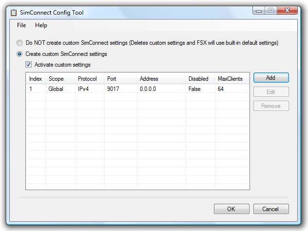
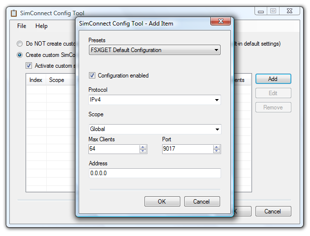

# SimConnect Config Tool

This little tool allows Flight Simulator X users to easily edit and setup their SimConnect configuration, e.g. in order to enable or disable remote applications such as [FSXGET](http://www.juergentreml.de/fsxget) to connect to Flight Simulator X.

The tool has been written as a result of the needs of some [FSXGET](http://www.juergentreml.de/fsxget) users but can be used to configure SimConnect in general (not only for use with [FSXGET](http://www.juergentreml.de/fsxget)). For any support or comment you have, use the [original homepage](http://www.juergentreml.de/simconnectconfigtool) of the tool (which is still not too crowded with information ;-) ) or the discussion page here on CodePlex. You may also want to have a look at the [contact information page on the FSXGET website](http://www.codeplex.com/fsxget/Wiki/View.aspx?title=Contact%20%26%20Support&referringTitle=Home).

A HowTo article on [setting up FSXGET for remote access to FSX on another computer](http://www.codeplex.com/fsxget/Wiki/View.aspx?title=%20HowTo%3a%20SimConnect%20Network%20Configuration&referringTitle=Help%2c%20FAQ%2c%20HowTos) using this tool can be found here.

_Screenshot - Main Window_

_Screenshot - Add / Edit Window_